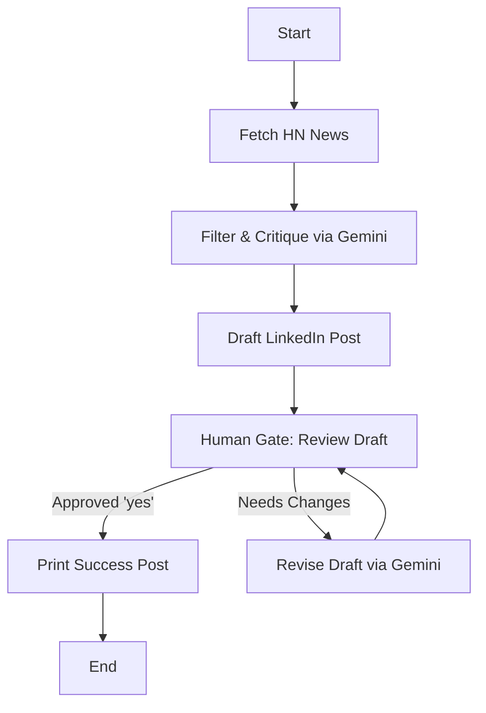

# LinkedIn Tech Content Curator Agent 🚀

An agentic AI workflow powered by **LangGraph** and **Gemini 2.5 Flash** that automatically fetches trending tech news, curates the best story for a professional LinkedIn audience, drafts an engaging post, and refines it interactively based on your feedback.

---

## 📌 Features

- **Automated Curation**: Fetches the top stories on Hacker News dynamically.
- **AI-Powered Evaluation**: Analyzes and filters articles for maximum LinkedIn engagement and professional relevance.
- **Engaging Drafting**: Drafts structured posts featuring hooks, key technical takeaways, emoji bullet points, calls-to-action, and relevant hashtags.
- **Human-in-the-Loop Gate**: Pauses execution to show you the draft and request approval or specific revision feedback.
- **Interactive Revision Loop**: Adapts and rewrites the content based on your feedback until you type `yes`.

---

## 🛠️ Architecture Workflow

Here is how the LangGraph agent manages state and routes tasks:



---

## 🚀 Setup & Installation

### 1. Prerequisites
- Python 3.9+
- Git

### 2. Clone and Setup
If you haven't already, clone the repository:
```bash
git clone https://github.com/mpatel184/linkedin-tech-agent.git
cd linkedin-tech-agent
```

### 3. Create a Virtual Environment
Create and activate your Python virtual environment:
```bash
# Windows
python -m venv venv
venv\Scripts\activate

# macOS / Linux
python3 -m venv venv
source venv/bin/activate
```

### 4. Install Dependencies
```bash
pip install langchain-core langchain-google-genai langgraph pydantic python-dotenv requests
```

### 5. Environment Variables
Create a `.env` file in the root directory (this is ignored by Git to keep your API keys secure):
```env
GOOGLE_API_KEY=your_gemini_api_key_here
```

---

## 💻 How to Run

Execute the main agent script:
```bash
python agent.py
```

1. The agent will fetch the front-page articles.
2. It will display the selected article, target audience, and the draft post.
3. In the terminal, type `yes` to accept, or write feedback (e.g., *"Make it shorter and focus more on software architecture"*).
4. Copy-paste the final printed output directly to your LinkedIn!
